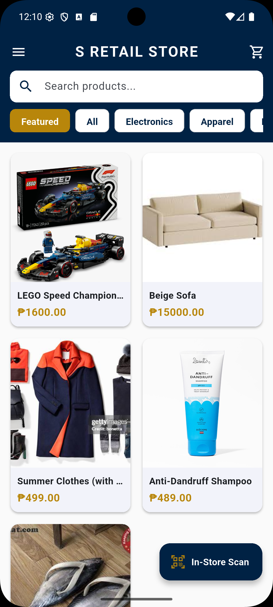
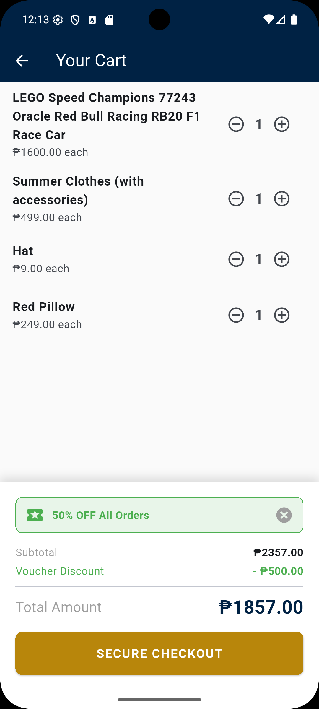
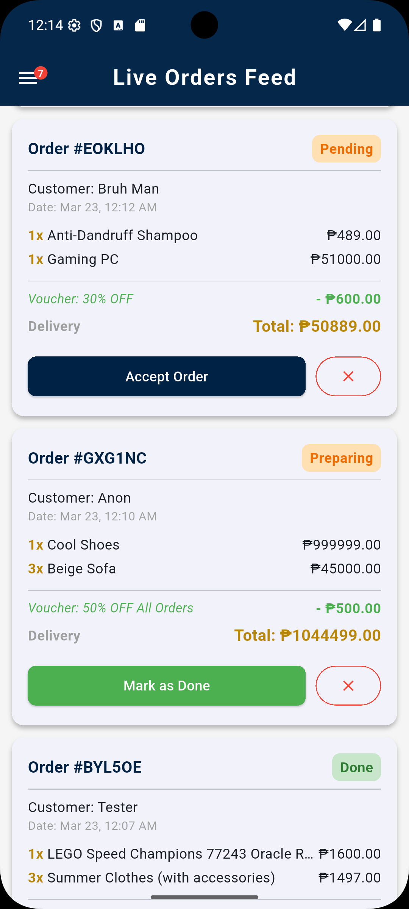

# 🛒 S-Retail Store (B2C Ecosystem)


A full-stack, cloud-connected B2C retail ecosystem built with Flutter and Firebase. This application serves as a complete platform connecting a **Retail Administrator** (managing inventory, orders, and promotions) and a **Consumer** (browsing, earning rewards, and purchasing products).

**Built by Group 1 as the Final Project for Mobile Application Development 2.**

---

## ✨ Features

### 🛍️ Consumer Module (Storefront)
* **Live Product Catalog:** Real-time synchronization with the cloud database. If an admin changes a price or stock level, the UI updates instantly.
* **Smart Shopping Cart:** Interactive cart with dynamic quantity adjustments and real-time subtotal calculations.
* **Secure Cloud Checkout:** Utilizes ACID-compliant Firestore Transactions to guarantee accurate stock deduction and prevent race conditions during checkout.
* **Digital Economy (Rewards Hub):** * In-Store QR Scanner allows users to "check in" and earn loyalty points.
  * Points can be redeemed for dynamic discount Vouchers.
  * Vouchers are securely applied at checkout and permanently burned from the user's wallet upon use.

### 🏢 Admin Module (Back-office)
* **Live Orders Feed:** A real-time dashboard monitoring incoming consumer purchases, applied voucher data, and order statuses (Pending, Preparing, Done).
* **Inventory Management (CRUD):** Complete control over the product catalog, including updating stock, prices, SKUs, and featuring specific items on the consumer homepage.
* **Voucher Management:** Create custom promotional vouchers (e.g., "50% Off", "Cap at ₱500") and assign point costs for consumers to unlock.

---

## 📸 App Showcase

<p align="center">
  
  
  
  
</p>

---

## 🛠️ Technology Stack
* **Frontend:** Flutter (Dart)
* **Backend:** Firebase (Cloud Firestore, Firebase Authentication)
* **State Management:** Provider
* **Architecture:** Model-View-Controller (MVC) adaptation with separate service layers.

---

## 🚀 Getting Started

Follow these instructions to get a copy of the project up and running on your local machine for development and testing purposes.

### Prerequisites
* [Flutter SDK](https://docs.flutter.dev/get-started/install) (Version 3.10+)
* [Firebase CLI](https://firebase.google.com/docs/cli)
* Android Studio or VS Code

### Installation

1. **Clone the repository:**
   ```bash
   git clone https://github.com/whyburrito/S-Retail-Hub.git
   cd S-Retail-Hub
   ```

2. **Install Flutter dependencies:**
   ```bash
   flutter pub get
   ```

3. **Connect to your own Firebase Project:**
   *(Note: For security reasons, the original `firebase_options.dart` and `google-services.json` files are gitignored. You will need to link your own Firebase project).*
   ```bash
   dart pub global activate flutterfire_cli
   flutterfire configure
   ```

4. **Run the app:**
   Ensure you have an emulator running or a physical device connected.
   ```bash
   flutter run
   ```

---

## 🧠 Technical Highlights for Reviewers
* **Firestore Transactions:** The checkout process uses strict Firebase `runTransaction` blocks. It ensures 100% of read operations (verifying stock levels and voucher ownership) occur before any write operations, preventing data corruption even under heavy simulated load.
* **Relational Data Mapping:** Successfully bridges NoSQL collections (Users -> Points -> Vouchers -> Orders) to create a seamless digital economy without relying on client-side state manipulation.
